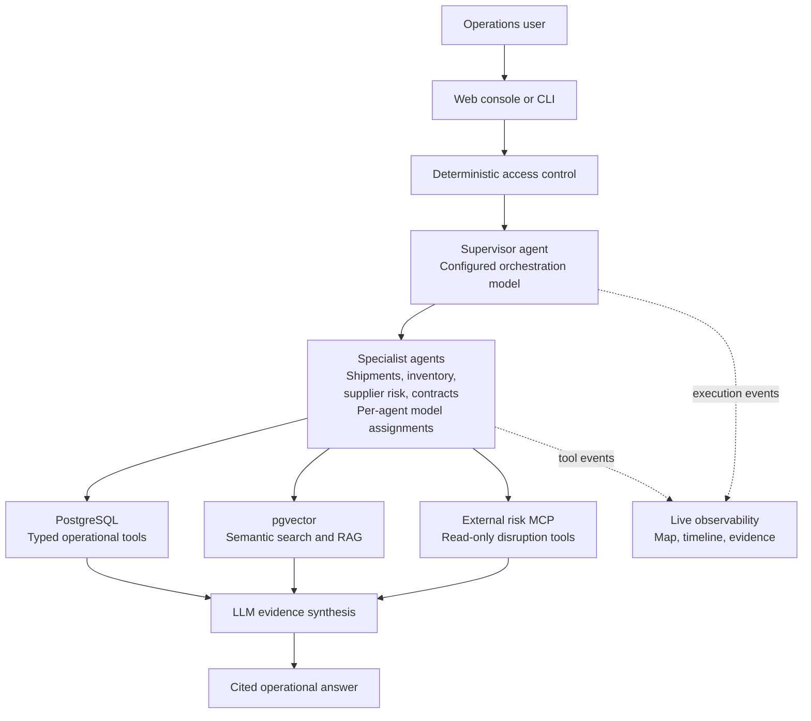

# Supply Chain AI Control Tower Architecture

## Architecture At A Glance

Start here for the interview-level view. Deterministic application code controls access and data
retrieval; the model chooses specialists and synthesizes only the evidence returned by typed local
tools, semantic retrieval, and allowlisted MCP tools.

## Detailed Implementation Map

The map below expands the runtime flow into its trust boundaries, services, infrastructure, and
source-file ownership. The central design rule remains the same: model-driven routing stops at
typed local tools or allowlisted, read-only MCP tools; authorization and SQL construction remain
deterministic application code.

```mermaid
flowchart TB
    USER["Operations manager"]

    subgraph INTERFACES["1. Interfaces"]
        direction LR
        WEB["Web operations console<br/>and REST API"]
        CLI["Command-line interface"]
        INTERFACE_FILES["Files<br/>src/control_tower/web.py<br/>src/control_tower/cli.py<br/>src/control_tower/static/index.html<br/>src/control_tower/static/app.js<br/>src/control_tower/static/styles.css"]:::files
    end

    subgraph TRUST["2. Deterministic identity and run boundary"]
        direction LR
        ACCESS["AccessService<br/>Resolve organization, role,<br/>warehouses, and supplier scope"]:::trusted
        CONVERSATIONS["ConversationService<br/>Enforce user-owned history"]:::trusted
        RUNTIME["AgentRuntime<br/>DB session + AccessContext + as-of date<br/>Local context, never model-controlled"]:::trusted
        SERVICE["AgentService<br/>Validate configuration,<br/>embed the question, start the run"]:::trusted
        TRUST_FILES["Files<br/>src/control_tower/access.py<br/>src/control_tower/conversations.py<br/>src/control_tower/agent_service.py<br/>src/control_tower/agents/runtime.py<br/>src/control_tower/config.py"]:::files
        ACCESS --> RUNTIME --> SERVICE
    end

    subgraph ORCHESTRATION["3. Multi-agent orchestration"]
        direction TB
        RUNNER["OpenAI Agents SDK runner<br/>Structured Pydantic outputs"]:::agent
        SUPERVISOR["Supervisor agent<br/>Can call specialists only<br/>Independent model assignment<br/>No direct database access"]:::agent

        subgraph SPECIALISTS["Specialists exposed to the supervisor as tools"]
            direction LR
            SHIPMENT["Shipment<br/>specialist"]:::agent
            INVENTORY["Inventory<br/>specialist"]:::agent
            SUPPLIER["Supplier-risk<br/>specialist"]:::agent
            CONTRACTS["Contracts and compliance<br/>specialist"]:::agent
        end

        AGENT_FILES["Files<br/>src/control_tower/agents/llm.py<br/>src/control_tower/agents/__init__.py"]:::files
        RUNNER --> SUPERVISOR
        SUPERVISOR --> SHIPMENT
        SUPERVISOR --> INVENTORY
        SUPERVISOR --> SUPPLIER
        SUPERVISOR --> CONTRACTS
    end

    subgraph DOMAIN["4. Deterministic domain tools and retrieval"]
        direction LR
        SHIPMENT_TOOLS["Shipment tools<br/>Delayed arrivals and tracking"]:::service
        INVENTORY_TOOLS["Inventory tools<br/>Stock risk and history"]:::service
        SUPPLIER_TOOLS["Supplier analytics<br/>Risk, scorecards, incidents"]:::service
        RETRIEVAL["Scoped hybrid retrieval<br/>Keyword + vector ranking<br/>with citations"]:::service
        EMBEDDINGS["Embedding provider<br/>and document indexer"]:::service
        DOMAIN_FILES["Files<br/>src/control_tower/tools.py<br/>src/control_tower/analytics.py<br/>src/control_tower/retrieval.py<br/>src/control_tower/embeddings.py"]:::files
    end

    subgraph PERSISTENCE["5. Persistence and vector store"]
        direction LR
        ORM["SQLAlchemy relational model<br/>and session boundary"]:::data
        POSTGRES["PostgreSQL<br/>Operational tables"]:::data
        PGVECTOR["pgvector<br/>VECTOR(384) document chunks"]:::data
        SQLITE["SQLite fallback<br/>Local demo and tests"]:::data
        MIGRATIONS["Alembic migrations<br/>Versioned schema lifecycle"]:::service
        DATA_FILES["Files<br/>src/control_tower/models.py<br/>src/control_tower/database.py<br/>src/control_tower/schema.py<br/>src/control_tower/migrations/*<br/>compose.yaml"]:::files
        MIGRATIONS --> ORM
        ORM --> POSTGRES
        ORM --> PGVECTOR
        ORM --> SQLITE
    end

    subgraph MCP["6. External disruption intelligence over MCP"]
        direction LR
        MCP_CLIENT["Agents SDK MCP client<br/>Streamable HTTP lifecycle<br/>Per-specialist tool allowlists"]:::service
        MCP_SERVER["Standalone risk-feed MCP server<br/>Five structured read-only tools<br/>Resources + health endpoint"]:::external
        RISK_DATA["Eight synthetic external events<br/>Ports, lanes, carriers,<br/>suppliers, and compliance"]:::data
        MCP_FILES["Files<br/>src/control_tower/integrations/risk_mcp_client.py<br/>src/control_tower/integrations/risk_mcp_server.py<br/>src/control_tower/integrations/risk_feed.py<br/>Dockerfile<br/>compose.yaml"]:::files
        MCP_CLIENT <--> MCP_SERVER
        MCP_SERVER --> RISK_DATA
    end

    subgraph OBSERVABILITY["7. Live execution observability"]
        direction LR
        TRACE["ExecutionTrace<br/>Typed events, timing,<br/>and deterministic redaction"]:::observe
        SSE["SSE transport<br/>Live trace and final result"]:::observe
        TRACE_UI["Operations console<br/>Map, timeline, evidence,<br/>and exchange inspector"]:::observe
        TRACE_FILES["Files<br/>src/control_tower/observability.py<br/>src/control_tower/web.py<br/>src/control_tower/static/index.html<br/>src/control_tower/static/app.js<br/>src/control_tower/static/styles.css"]:::files
        TRACE --> SSE --> TRACE_UI
    end

    subgraph EXTERNAL["8. External AI services"]
        direction LR
        RESPONSES["OpenAI Responses API<br/>Server-controlled per-agent models"]:::external
        EMBEDDING_API["OpenAI Embeddings API<br/>Document and query vectors"]:::external
        EXTERNAL_FILES["Configuration<br/>.env.example<br/>pyproject.toml"]:::files
    end

    subgraph SUPPORT["9. Synthetic data, developer workflow, and quality"]
        direction LR
        SEEDER["Correlated synthetic<br/>data generator"]:::support
        OFFLINE["Deterministic local<br/>demonstration workflow"]:::support
        EVALUATIONS["Golden multi-agent<br/>evaluation cases"]:::support
        TESTS["Automated tests"]:::support
        CI["GitHub Actions CI<br/>Quality, integrations,<br/>and Compose smoke test"]:::support
        SUPPORT_FILES["Files<br/>src/control_tower/synthetic.py<br/>src/control_tower/agents/supervisor.py<br/>src/control_tower/agents/specialists.py<br/>src/control_tower/agents/types.py<br/>src/control_tower/evaluation.py<br/>evals/cases.json<br/>tests/*"]:::files
        DEV_WORKFLOW["VS Code tasks and debugging<br/>.vscode/tasks.json<br/>.vscode/launch.json<br/>.vscode/settings.json<br/>.vscode/extensions.json"]:::files
        CI_FILES["Pipeline files<br/>.github/workflows/ci.yml<br/>Dockerfile<br/>compose.yaml"]:::files
    end

    USER --> WEB
    USER --> CLI
    WEB --> ACCESS
    CLI --> ACCESS
    WEB --> CONVERSATIONS
    CONVERSATIONS --> ORM
    SERVICE --> RUNNER
    SERVICE -. "connect, health, fallback" .-> MCP_CLIENT
    ACCESS -. "access events" .-> TRACE
    SUPERVISOR -. "agent lifecycle" .-> TRACE
    SHIPMENT_TOOLS -. "tool events" .-> TRACE
    INVENTORY_TOOLS -. "tool events" .-> TRACE
    SUPPLIER_TOOLS -. "tool events" .-> TRACE
    RETRIEVAL -. "retrieval events" .-> TRACE
    MCP_CLIENT -. "MCP events" .-> TRACE

    RUNNER <--> RESPONSES
    SERVICE --> EMBEDDINGS
    EMBEDDINGS <--> EMBEDDING_API

    SHIPMENT --> SHIPMENT_TOOLS
    INVENTORY --> INVENTORY_TOOLS
    SUPPLIER --> SUPPLIER_TOOLS
    CONTRACTS --> RETRIEVAL
    SHIPMENT --> MCP_CLIENT
    SUPPLIER --> MCP_CLIENT
    CONTRACTS --> MCP_CLIENT

    RUNTIME -. "injects allowed IDs" .-> SHIPMENT_TOOLS
    RUNTIME -. "injects allowed IDs" .-> INVENTORY_TOOLS
    RUNTIME -. "injects allowed IDs" .-> SUPPLIER_TOOLS
    RUNTIME -. "injects allowed IDs" .-> RETRIEVAL

    SHIPMENT_TOOLS --> ORM
    INVENTORY_TOOLS --> ORM
    SUPPLIER_TOOLS --> ORM
    RETRIEVAL --> ORM
    EMBEDDINGS --> ORM

    SEEDER --> ORM
    OFFLINE --> SHIPMENT_TOOLS
    OFFLINE --> INVENTORY_TOOLS
    OFFLINE --> RETRIEVAL
    EVALUATIONS --> SERVICE
    TESTS -. "verifies" .-> ACCESS
    TESTS -. "verifies" .-> SUPERVISOR
    TESTS -. "verifies" .-> ORM
    TESTS -. "verifies protocol boundary" .-> MCP_SERVER
    CI -. "migrate and smoke test" .-> POSTGRES
    CI -. "connect and verify" .-> MCP_SERVER

    classDef files fill:#ffffff,stroke:#8a9099,stroke-width:1px,stroke-dasharray:4 3,color:#343a40;
    classDef trusted fill:#fff4cc,stroke:#9a6700,stroke-width:2px,color:#3f2d00;
    classDef agent fill:#e7f1ff,stroke:#2767a5,stroke-width:2px,color:#163a5f;
    classDef service fill:#e8f6ec,stroke:#357a4c,stroke-width:2px,color:#204b30;
    classDef data fill:#f2ecfb,stroke:#7654a3,stroke-width:2px,color:#412d5c;
    classDef external fill:#f1f3f5,stroke:#5f6873,stroke-width:2px,color:#30363d;
    classDef support fill:#fff0e5,stroke:#a85d2a,stroke-width:2px,color:#5e331b;
    classDef observe fill:#eaf7f6,stroke:#087f75,stroke-width:2px,color:#174a46;
```

## Request Lifecycle

1. The web API or CLI identifies the caller and asks `AccessService` for a trusted scope.
2. `AgentService` creates `AgentRuntime`; organization and warehouse IDs never become model
   arguments.
3. Server settings assign an effective model to the supervisor and every specialist. The browser
   can observe those assignments but cannot change them.
4. The supervisor chooses one or more specialists. It has no SQL or retrieval tools itself.
5. Each specialist calls only its typed domain tools and its allowlisted MCP tools. Inventory has
   no MCP access, and the supervisor has no direct data tools.
6. Local tools apply the trusted scope while constructing SQLAlchemy queries or ranking document
   chunks.
7. Shipment, supplier-risk, and compliance specialists may send public codes or locations learned
   from authorized records to the external MCP feed. Tenant IDs and warehouse scope are never MCP
   tool arguments.
8. The MCP server deterministically filters its separate synthetic feed and returns structured
   `external-risk:` evidence. If startup fails, the agent system is rebuilt without MCP and local
   analysis remains available.
9. Specialists return structured findings and evidence to the supervisor LLM, which composes the
   final operational answer.
10. Conversation history is persisted under the owning user, and source-aware tool events provide
   a visible PostgreSQL, pgvector, and MCP execution trace.
11. The API publishes redacted lifecycle events over SSE; the UI maps them to live node states,
    an ordered timeline, durable evidence, and a selected-exchange inspector.

Solid arrows represent calls or data flow. Dotted arrows represent trusted policy injection or
verification rather than model-controlled input.
