# SupplyScope Architecture

This diagram shows the runtime request flow and the source files owned by each architectural
segment. The central design rule is that model-driven routing stops at typed tools;
authorization and SQL construction remain deterministic application code.

```mermaid
flowchart TB
    USER["Operations manager"]

    subgraph INTERFACES["1. Interfaces"]
        direction LR
        WEB["Web operations console<br/>and REST API"]
        CLI["Command-line interface"]
        INTERFACE_FILES["Files<br/>src/supplyscope/web.py<br/>src/supplyscope/cli.py<br/>src/supplyscope/static/index.html<br/>src/supplyscope/static/app.js<br/>src/supplyscope/static/styles.css"]:::files
    end

    subgraph TRUST["2. Deterministic identity and run boundary"]
        direction LR
        ACCESS["AccessService<br/>Resolve organization, role,<br/>warehouses, and supplier scope"]:::trusted
        CONVERSATIONS["ConversationService<br/>Enforce user-owned history"]:::trusted
        RUNTIME["AgentRuntime<br/>DB session + AccessContext + as-of date<br/>Local context, never model-controlled"]:::trusted
        SERVICE["AgentService<br/>Validate configuration,<br/>embed the question, start the run"]:::trusted
        TRUST_FILES["Files<br/>src/supplyscope/access.py<br/>src/supplyscope/conversations.py<br/>src/supplyscope/agent_service.py<br/>src/supplyscope/agents/runtime.py<br/>src/supplyscope/config.py"]:::files
        ACCESS --> RUNTIME --> SERVICE
    end

    subgraph ORCHESTRATION["3. Multi-agent orchestration"]
        direction TB
        RUNNER["OpenAI Agents SDK runner<br/>Structured Pydantic outputs"]:::agent
        SUPERVISOR["Supervisor agent<br/>Can call specialists only<br/>No direct database access"]:::agent

        subgraph SPECIALISTS["Specialists exposed to the supervisor as tools"]
            direction LR
            SHIPMENT["Shipment<br/>specialist"]:::agent
            INVENTORY["Inventory<br/>specialist"]:::agent
            SUPPLIER["Supplier-risk<br/>specialist"]:::agent
            CONTRACTS["Contracts and compliance<br/>specialist"]:::agent
        end

        AGENT_FILES["Files<br/>src/supplyscope/agents/llm.py<br/>src/supplyscope/agents/__init__.py"]:::files
        RUNNER --> SUPERVISOR
        SUPERVISOR --> SHIPMENT
        SUPERVISOR --> INVENTORY
        SUPERVISOR --> SUPPLIER
        SUPERVISOR --> CONTRACTS
    end

    subgraph DOMAIN["4. Deterministic domain tools and retrieval"]
        direction LR
        SHIPMENT_TOOLS["Shipment tools<br/>Delayed arrivals and tracking"]:::service
        INVENTORY_TOOLS["Inventory tools<br/>Stock risk and history"]:::service
        SUPPLIER_TOOLS["Supplier analytics<br/>Risk, scorecards, incidents"]:::service
        RETRIEVAL["Scoped hybrid retrieval<br/>Keyword + vector ranking<br/>with citations"]:::service
        EMBEDDINGS["Embedding provider<br/>and document indexer"]:::service
        DOMAIN_FILES["Files<br/>src/supplyscope/tools.py<br/>src/supplyscope/analytics.py<br/>src/supplyscope/retrieval.py<br/>src/supplyscope/embeddings.py"]:::files
    end

    subgraph PERSISTENCE["5. Persistence and vector store"]
        direction LR
        ORM["SQLAlchemy relational model<br/>and session boundary"]:::data
        POSTGRES["PostgreSQL<br/>Operational tables"]:::data
        PGVECTOR["pgvector<br/>VECTOR(384) document chunks"]:::data
        SQLITE["SQLite fallback<br/>Local demo and tests"]:::data
        DATA_FILES["Files<br/>src/supplyscope/models.py<br/>src/supplyscope/database.py<br/>compose.yaml"]:::files
        ORM --> POSTGRES
        ORM --> PGVECTOR
        ORM --> SQLITE
    end

    subgraph EXTERNAL["6. External AI services"]
        direction LR
        RESPONSES["OpenAI Responses API<br/>Supervisor and specialist models"]:::external
        EMBEDDING_API["OpenAI Embeddings API<br/>Document and query vectors"]:::external
        EXTERNAL_FILES["Configuration<br/>.env.example<br/>pyproject.toml"]:::files
    end

    subgraph SUPPORT["7. Synthetic data, developer workflow, and quality"]
        direction LR
        SEEDER["Correlated synthetic<br/>data generator"]:::support
        OFFLINE["Deterministic local<br/>demonstration workflow"]:::support
        EVALUATIONS["Golden multi-agent<br/>evaluation cases"]:::support
        TESTS["Automated tests"]:::support
        SUPPORT_FILES["Files<br/>src/supplyscope/synthetic.py<br/>src/supplyscope/agents/supervisor.py<br/>src/supplyscope/agents/specialists.py<br/>src/supplyscope/agents/types.py<br/>src/supplyscope/evaluation.py<br/>evals/cases.json<br/>tests/*"]:::files
        DEV_WORKFLOW["VS Code tasks and debugging<br/>.vscode/tasks.json<br/>.vscode/launch.json<br/>.vscode/settings.json<br/>.vscode/extensions.json"]:::files
    end

    USER --> WEB
    USER --> CLI
    WEB --> ACCESS
    CLI --> ACCESS
    WEB --> CONVERSATIONS
    CONVERSATIONS --> ORM
    SERVICE --> RUNNER

    RUNNER <--> RESPONSES
    SERVICE --> EMBEDDINGS
    EMBEDDINGS <--> EMBEDDING_API

    SHIPMENT --> SHIPMENT_TOOLS
    INVENTORY --> INVENTORY_TOOLS
    SUPPLIER --> SUPPLIER_TOOLS
    CONTRACTS --> RETRIEVAL

    RUNTIME -. "injects allowed IDs" .-> SHIPMENT_TOOLS
    RUNTIME -. "injects allowed IDs" .-> INVENTORY_TOOLS
    RUNTIME -. "injects allowed IDs" .-> SUPPLIER_TOOLS
    RUNTIME -. "injects allowed IDs" .-> RETRIEVAL

    SHIPMENT_TOOLS --> ORM
    INVENTORY_TOOLS --> ORM
    SUPPLIER_TOOLS --> ORM
    RETRIEVAL --> ORM
    EMBEDDINGS --> ORM

    SEEDER --> ORM
    OFFLINE --> SHIPMENT_TOOLS
    OFFLINE --> INVENTORY_TOOLS
    OFFLINE --> RETRIEVAL
    EVALUATIONS --> SERVICE
    TESTS -. "verifies" .-> ACCESS
    TESTS -. "verifies" .-> SUPERVISOR
    TESTS -. "verifies" .-> ORM

    classDef files fill:#ffffff,stroke:#8a9099,stroke-width:1px,stroke-dasharray:4 3,color:#343a40;
    classDef trusted fill:#fff4cc,stroke:#9a6700,stroke-width:2px,color:#3f2d00;
    classDef agent fill:#e7f1ff,stroke:#2767a5,stroke-width:2px,color:#163a5f;
    classDef service fill:#e8f6ec,stroke:#357a4c,stroke-width:2px,color:#204b30;
    classDef data fill:#f2ecfb,stroke:#7654a3,stroke-width:2px,color:#412d5c;
    classDef external fill:#f1f3f5,stroke:#5f6873,stroke-width:2px,color:#30363d;
    classDef support fill:#fff0e5,stroke:#a85d2a,stroke-width:2px,color:#5e331b;
```

## Request Lifecycle

1. The web API or CLI identifies the caller and asks `AccessService` for a trusted scope.
2. `AgentService` creates `AgentRuntime`; organization and warehouse IDs never become model
   arguments.
3. The supervisor chooses one or more specialists. It has no SQL or retrieval tools itself.
4. Each specialist calls only its typed domain tools.
5. Tools apply the trusted scope while constructing SQLAlchemy queries or ranking document
   chunks.
6. Specialists return structured findings and evidence to the supervisor, which composes the
   operational answer.
7. Conversation history is persisted under the owning user, and tool events provide a visible
   execution trace.

Solid arrows represent calls or data flow. Dotted arrows represent trusted policy injection or
verification rather than model-controlled input.
