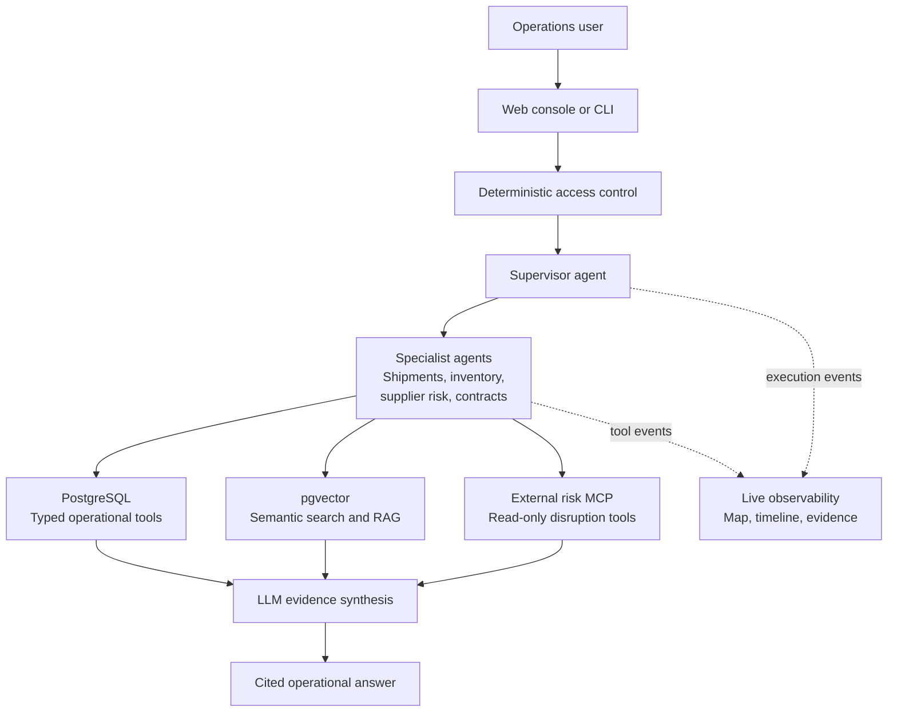

# Supply Chain AI Control Tower

[](https://github.com/shshakib/Supply-Chain-AI-Control-Tower/actions/workflows/ci.yml)

Supply Chain AI Control Tower is an original, synthetic supply-chain intelligence application
for a technical portfolio. It combines a manager-style multi-agent workflow, deterministic
authorization, typed database tools, PostgreSQL/pgvector retrieval, persistent conversations,
a separately deployed Model Context Protocol (MCP) risk feed, and a focused operations console.

No private source code or private data is included. The schema, prompts, synthetic scenarios,
tools, and interface were designed independently for this project.

## Architecture



This is the interview-level view. [Open the detailed implementation map](ARCHITECTURE.md) for
the complete request flow, trust boundaries, service relationships, and files owned by each
architectural segment.

The supervisor calls specialists as tools using the OpenAI Agents SDK. Specialists can call
only their own typed tools. A local `AgentRuntime` carries the authenticated access context,
database session, fixed as-of date, retriever, and tool-event trace. That context is not a
model-editable argument.

MCP has one specific job: shipment, supplier-risk, and compliance specialists use it to read
synthetic external disruption intelligence. Internal shipments, inventory, authorization, and
contracts remain in the Control Tower database. The MCP service is a separate process and does
not receive tenant IDs or database credentials.

## Implemented Capabilities

- OpenAI Agents SDK supervisor with four specialist agents
- Server-controlled per-agent model assignments with a shared specialist fallback
- Pydantic structured outputs for specialist reports and final answers
- Deterministic organization, warehouse, supplier, and conversation authorization
- Typed SQLAlchemy tools instead of unrestricted model-generated SQL
- PostgreSQL schema with a native `VECTOR(384)` document embedding column
- Alembic schema migrations shared by SQLite and PostgreSQL
- OpenAI embedding indexing with configurable model and dimensions
- Scoped hybrid retrieval using vector similarity and keyword ranking
- Standalone Streamable HTTP MCP server with five structured, read-only risk tools
- Per-specialist MCP tool allowlists, health reporting, and graceful local fallback
- Source-aware evidence traces for PostgreSQL, pgvector retrieval, and MCP calls
- Live SSE execution observability with a runtime map, timeline, and exchange inspector
- SQLite vector-search fallback for development and tests
- Persistent conversations and message history
- FastAPI chat, persona, conversation, health, and deterministic-demo endpoints
- Responsive operations console with specialist activity and citations
- Full Docker Compose stack and three-gate GitHub Actions CI pipeline
- Seven golden LLM evaluation cases, including an MCP evidence case
- Deterministic local demo that remains available without an API key

## Quick Start

The shortest path to the production-style stack requires Docker Desktop:

```powershell
git clone https://github.com/shshakib/Supply-Chain-AI-Control-Tower.git
cd Supply-Chain-AI-Control-Tower
docker compose up --build
```

This starts PostgreSQL/pgvector, applies Alembic migrations, seeds the database if it is empty,
starts the external-risk MCP service, and starts the web application. Open
`http://127.0.0.1:8000`. The offline scenario works without an API key.

For the lightweight SQLite development path:

```powershell
python -m venv .venv
.\.venv\Scripts\Activate.ps1
python -m pip install -e ".[dev]"
control-tower --database-url "sqlite:///./control_tower.db" seed
control-tower-risk-mcp                  # terminal 1
control-tower-web --database-url "sqlite:///./control_tower.db"  # terminal 2
```

**Run offline scenario** uses the deterministic local workflow and
works without an API key. Its Live Map shows access resolution, routing, specialist work, data
sources, synthesis, and the final answer as they execute. LLM chat requires `OPENAI_API_KEY`; it
uses the same trace and calls the MCP service when an external signal is relevant.

## VS Code Tasks And Debugging

Open the `Supply-Chain-AI-Control-Tower` folder itself as the VS Code workspace. The checked-in
`.vscode` configuration selects `.venv`, enables pytest discovery, and provides:

- `Ctrl+Shift+B`: run the SQLite web console and external-risk MCP service together
- **Terminal > Run Task > Supply Chain AI Control Tower: Run Full Local Stack**: start the web
  console and synthetic MCP risk feed together
- **Terminal > Run Task > Supply Chain AI Control Tower: Run External Risk MCP**: run only the
  Streamable HTTP MCP service
- **Terminal > Run Task > Supply Chain AI Control Tower: Seed SQLite Demo**: create or refresh local demo data
- **Terminal > Run Task > Supply Chain AI Control Tower: Run Offline Demo**: run the no-key workflow with a trace
- **Terminal > Run Task > Supply Chain AI Control Tower: Ask LLM (SQLite, API Key)**: prompt for a question and
  synthetic persona
- **Terminal > Run Task > Supply Chain AI Control Tower: Verify**: run tests, linting, and formatting checks
- **Terminal > Run Task > Supply Chain AI Control Tower: Prepare PostgreSQL Demo**: start the pgvector container
  and seed PostgreSQL

The Run and Debug panel includes a compound configuration for the web server and MCP service,
plus individual configurations for the offline CLI demo and an LLM question. Tasks whose names
include `API Key` require `OPENAI_API_KEY` in `.env`; PostgreSQL and Docker MCP tasks require
Docker Desktop.

## MCP In One Concrete Flow

For the question "What may be worsening shipment `SS-CRITICAL-001`?":

1. The shipment specialist reads the authorized shipment and tracking history from PostgreSQL.
2. It learns that BlueArc Logistics recorded an exception at the Port of Vancouver.
3. It calls `search_disruption_events` or `get_carrier_advisories` through MCP.
4. The separate risk-feed service returns `external-risk:EXT-2026-001`, a synthetic Vancouver
   terminal disruption.
5. The specialist labels the event as correlated external evidence, not confirmed causation.
6. The supervisor LLM combines that evidence with inventory and contract findings into the final
   answer.

MCP is the interoperability boundary, not another reasoning layer. The OpenAI Agents SDK client
discovers and calls tools exposed by the independent MCP server over Streamable HTTP. If that
service is offline, the agents continue with local SQL and RAG evidence and disclose the missing
external signal.

The implementation follows the official [OpenAI Agents SDK MCP integration guide](https://openai.github.io/openai-agents-python/mcp/)
and uses the official [MCP Python SDK](https://github.com/modelcontextprotocol/python-sdk).

## Live Execution Observability

Both `/api/chat/stream` and `/api/demo/stream` return Server-Sent Events. The browser renders
those events in three coordinated views:

- **Map** lights up the deterministic access boundary, supervisor, specialists, PostgreSQL,
  RAG retrieval, MCP, synthesis, and answer nodes.
- **Timeline** preserves the exact event order with source labels and measured durations.
- **Evidence** shows the durable tool records and citations returned with the answer.

The supervisor is the parent orchestration span, so it remains active while delegated specialists
run and while their evidence is synthesized. Its map label changes from planning to coordinating,
reviewing evidence, and synthesizing so the open span is not mistaken for one continuous model
call. Directional connectors show which stage is active or complete, and the light/dark theme
preference is stored locally in the browser.

Selecting a specialist map node opens a safe input/output exchange: the delegated supervisor task,
the specialist's structured summary, cited evidence claims, limitations, and duration. Tool nodes
show redacted arguments, result counts, source, and parent stage. The evidence view groups stable
references into operational records, external MCP intelligence, and retrieved document passages.
The trace deliberately excludes hidden model reasoning, system prompts, credentials, internal
UUIDs, and raw unrestricted model output. The same event schema covers started, completed, failed,
skipped, and informational states, so unavailable services and unused specialists are visible
instead of silently omitted.

## Enable LLM Chat And RAG

Create `.env` from `.env.example` and set:

```dotenv
OPENAI_API_KEY=your_api_key
CONTROL_TOWER_SUPERVISOR_MODEL=gpt-5.6-terra
CONTROL_TOWER_SPECIALIST_MODEL=gpt-5.6-luna
CONTROL_TOWER_SHIPMENT_MODEL=gpt-5.6-luna
CONTROL_TOWER_INVENTORY_MODEL=gpt-5.6-luna
CONTROL_TOWER_SUPPLIER_RISK_MODEL=gpt-5.6-luna
CONTROL_TOWER_CONTRACTS_MODEL=gpt-5.6-terra
CONTROL_TOWER_EMBEDDING_MODEL=text-embedding-3-small
CONTROL_TOWER_EMBEDDING_DIMENSIONS=384
CONTROL_TOWER_RISK_MCP_ENABLED=true
CONTROL_TOWER_RISK_MCP_URL=http://127.0.0.1:8010/mcp
```

Model names are server configuration, so they can be changed to models available to the API
project. The four per-agent variables are optional and fall back to
`CONTROL_TOWER_SPECIALIST_MODEL` when blank or omitted. The example profile reserves the stronger
orchestration model for the supervisor and contracts/compliance while using the lower-cost model
for high-volume operational analysis. The effective assignment appears beneath each agent in the
execution map and in `/api/health`; it cannot be changed by a browser request. See the official
[OpenAI model guide](https://developers.openai.com/api/docs/models) for current model tradeoffs.
Do not place an API key in the browser or commit `.env`.

| Agent | Server setting | Example profile |
|---|---|---|
| Supervisor | `CONTROL_TOWER_SUPERVISOR_MODEL` | `gpt-5.6-terra` |
| Shipment specialist | `CONTROL_TOWER_SHIPMENT_MODEL` | `gpt-5.6-luna` |
| Inventory specialist | `CONTROL_TOWER_INVENTORY_MODEL` | `gpt-5.6-luna` |
| Supplier-risk specialist | `CONTROL_TOWER_SUPPLIER_RISK_MODEL` | `gpt-5.6-luna` |
| Contracts and compliance specialist | `CONTROL_TOWER_CONTRACTS_MODEL` | `gpt-5.6-terra` |

Index the synthetic documents:

```powershell
control-tower --database-url "sqlite:///./control_tower.db" index-documents
```

Then use the web console or ask from the CLI:

```powershell
control-tower --database-url "sqlite:///./control_tower.db" ask `
  "Which delayed shipments could stop production, and what contractual remedies apply?" `
  --trace
```

## PostgreSQL And pgvector

The complete PostgreSQL stack is one command:

```powershell
docker compose up --build
```

Compose exposes the UI on `8000`, MCP on `8010`, and PostgreSQL on `5433`. Published ports bind to
`127.0.0.1` by default so the unauthenticated portfolio demo is not exposed to the local network.
The `migrate` and `seed` services complete before the web service starts. Seeding is idempotent for
an existing demo volume. In PostgreSQL, semantic ranking uses the pgvector cosine-distance operator.

Stop the stack while retaining data with `docker compose down`. Use
`docker compose down --volumes` only when you intentionally want a fresh synthetic database.

## Database Migrations

Alembic owns the persistent database schema. Apply all pending revisions with:

```powershell
control-tower migrate
```

`init-db` remains as a backwards-compatible alias. When a model changes, generate a revision with
`alembic revision --autogenerate -m "describe the schema change"`, review the generated SQL, and
apply it with `control-tower migrate`. Seeding inserts demo rows; it does not define tables.

Databases created before migration support was introduced have no Alembic revision marker. Because
the included data is synthetic, reset those once with `docker compose down --volumes` or delete the
old local SQLite `.db` file, then seed again.

## Synthetic Dataset

The fixed demo date is `2026-06-30`. The generator creates:

| Entity | Count |
|---|---:|
| Synthetic users | 6 |
| Warehouses | 4 |
| Suppliers | 12 |
| Products | 30 |
| Purchase orders | 181 |
| Shipments | 181 |
| Inventory snapshots | 3,600 |
| Documents | 14 |
| External MCP risk events | 8 |

The main correlated scenario includes:

- Toronto has 30 available `MCU-X100` units and 3.8 days of cover.
- Shipment `SS-CRITICAL-001` contains 800 replacement units from Apex Circuits.
- A port labor disruption delays the shipment by nine days.
- An incident report describes the interruption and possible air-freight recovery.
- The supplier agreement permits a 4% credit after a five-day grace period, subject to
  force-majeure review.
- The separate synthetic MCP feed reports a critical Vancouver terminal disruption, a BlueArc
  capacity advisory, and an Apex capacity-watch signal with stable `external-risk:` references.

## Deterministic Access

| Persona | Role | Warehouse scope |
|---|---|---|
| `ava.admin@controltower.demo` | Global administrator | All |
| `noah.east@controltower.demo` | Regional operations | Toronto and Chicago |
| `mia.west@controltower.demo` | Regional operations | Vancouver and Austin |
| `priya.procurement@controltower.demo` | Procurement analyst | All |
| `leo.quality@controltower.demo` | Quality analyst | All |
| `sofia.viewer@controltower.demo` | Viewer | Toronto |

The access service resolves scope before the agent run. Tools inject organization and warehouse
filters from local context. Document retrieval applies the same warehouse and supplier scope
before keyword or vector ranking. Conversation reads are also restricted to their owning user.

## Agent Responsibilities

| Agent | Local tools | External MCP tools |
|---|---|---|
| Shipment specialist | Delayed inbound shipments, tracking history | Disruptions, lanes, carriers |
| Inventory specialist | Current low stock, inventory history | None |
| Supplier-risk specialist | Risk ranking, scorecards, quality incidents | Supplier watch signals |
| Contracts and compliance specialist | Scoped hybrid contract/report retrieval | Trade advisories |
| Supervisor | The four specialists only | None |

The LLM chooses specialists and tool arguments. Authorization, joins, aggregation, risk-score
calculation, date limits, and SQL construction remain deterministic Python code.

## Evaluation

The golden cases cover cross-domain routing, contract retrieval, supplier ranking, inventory
scope, shipment tracking, regional isolation, and MCP evidence usage:

```powershell
control-tower --database-url "sqlite:///./control_tower.db" evaluate
```

This command requires an API key. It checks expected specialists, evidence terms, forbidden
internal identifiers, and access-leakage indicators.

## Verification

```powershell
python -m pytest
python -m ruff check src tests
python -m ruff format --check src tests
```

## Continuous Integration

`.github/workflows/ci.yml` runs on every pull request and push to `main` without an OpenAI key:

1. **Python quality:** Ruff, formatting, unit tests, and a SQLite lifecycle smoke test.
2. **Live integrations:** Alembic and synthetic seeding against PostgreSQL/pgvector, plus a real
   Streamable HTTP connection to the MCP server.
3. **Container stack:** Builds the image, starts the complete Compose topology, verifies both
   health endpoints, and removes the test volume.

The workflow builds but does not publish an image. An image registry and deployment workflow can
be added later when a hosting platform is selected. After the first successful push, repository
branch protection can require the three CI jobs before changes are merged into `main`.

## Project Layout

```text
src/control_tower/
  access.py             deterministic authorization
  agent_service.py      OpenAI runner boundary
  agents/
    llm.py              supervisor, specialists, and function tools
    runtime.py          trusted local run context and tool trace
    supervisor.py       deterministic offline demonstration
  analytics.py          supplier, shipment, and inventory analytics
  conversations.py      scoped conversation persistence
  embeddings.py         OpenAI embedding provider and indexer
  integrations/
    risk_feed.py        deterministic synthetic external-risk dataset
    risk_mcp_server.py  standalone Streamable HTTP MCP server
    risk_mcp_client.py  Agents SDK connection, filtering, and fallback
  migrations/           Alembic environment and versioned schema revisions
  retrieval.py          scoped hybrid retrieval
  models.py             relational, vector, and conversation schema
  schema.py             programmatic migration commands
  observability.py      typed, redacted execution events and timing
  synthetic.py          correlated synthetic-data generator
  tools.py              core typed database tools
  web.py                FastAPI application
  static/               responsive operations console
evals/cases.json         golden LLM evaluation cases
tests/                   authorization, tools, RAG, MCP, agents, API, and UI backend tests
.github/workflows/ci.yml pull-request and main-branch CI pipeline
compose.yaml             complete PostgreSQL, migration, seed, MCP, and web stack
Dockerfile               shared web and MCP application image
.vscode/                 repeatable run, test, Docker, and debugger workflows
```

## Production Hardening

This is a complete portfolio implementation, not a production deployment. A production version
should add PostgreSQL row-level security, managed secrets, rate limiting, background embedding
jobs, durable trace storage, model-cost monitoring, stronger identity authentication, and a
hosting-specific continuous deployment workflow.
The checked-in PostgreSQL username and password are disposable local-demo credentials, and Compose
binds all published ports to loopback by default. Replace the credentials and put authenticated
services behind TLS before using the stack on a shared host.
An internet-facing MCP deployment should additionally use OAuth or signed service credentials,
strict origin and host policies, network timeouts, circuit breakers, and separate least-privilege
ownership of the external feed.
