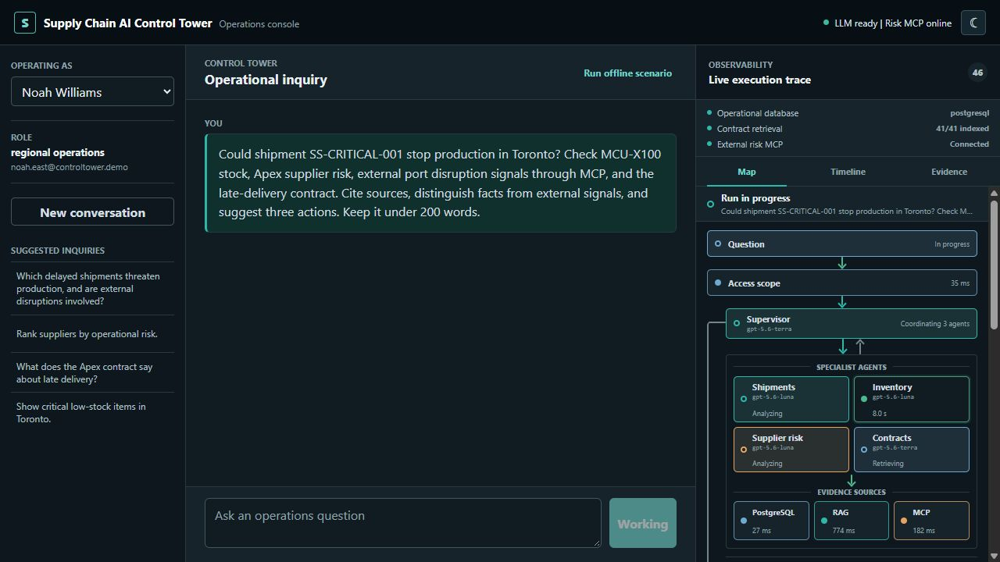
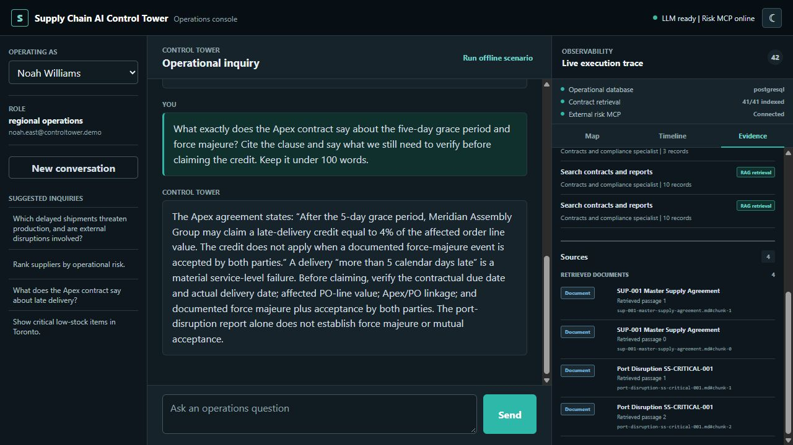
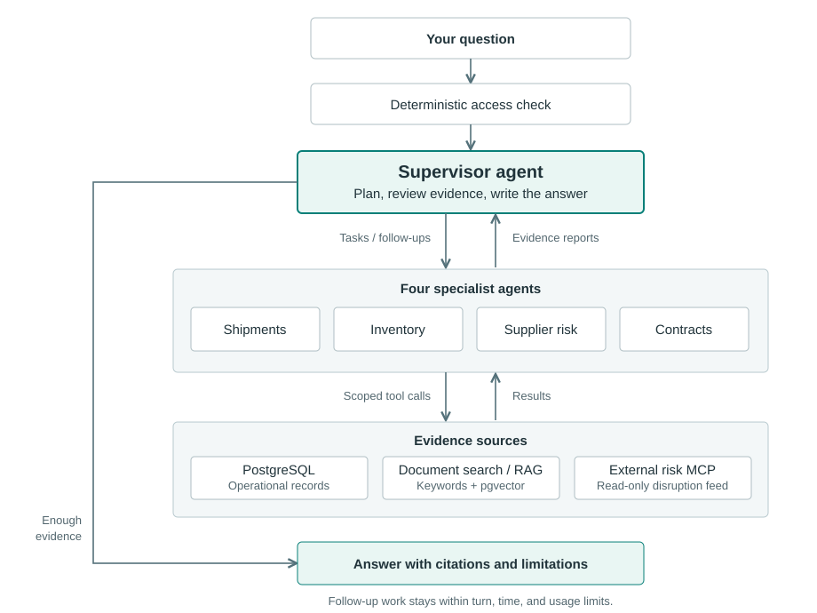

# Supply Chain AI Control Tower

[](https://github.com/shshakib/Supply-Chain-AI-Control-Tower/actions/workflows/ci.yml)

Ask a supply-chain question and get an answer backed by shipment records, stock levels,
supplier history, and contracts.

For example: **"Could this delayed shipment stop production in Toronto, and what can we do about it?"**
The app checks the relevant records, looks for external disruption reports, and brings the findings
together with citations. You can also see which agents ran, which tools they used, and what they returned.

I built this as a portfolio project to explore multi-agent workflows, RAG, and MCP in one working
application. All companies, people, documents, and events are synthetic. It does not include private
source code or real business data.

## A Look Inside

**An investigation with its live execution map.**



**The evidence behind the answer, with tool results and source references.**



These screenshots are from real LLM runs using synthetic data, PostgreSQL, document retrieval,
and the external-risk MCP server.

**[Watch the demo (2 min 43 sec)](docs/media/control-tower-demo.mp4)**

The silent walkthrough covers two questions, agent exchanges, the timeline, citations, and usage
estimates. It uses actual dark-mode UI captures, with waiting periods shortened for the video.

## How It Works



There is **one supervisor**, not a separate reviewer agent. Specialists return their findings to it.
It can ask for more evidence before writing the answer. Turn, time, and usage limits bound the run.

| Part | What it does |
|---|---|
| Web console | Sends questions to FastAPI over HTTP and receives live trace events through Server-Sent Events (SSE). |
| Supervisor and specialists | Use the OpenAI Agents SDK. Delegation happens inside the Python app; model calls go to OpenAI over HTTPS. |
| Database tools | Read authorized shipment, inventory, and supplier data through SQLAlchemy. The model does not write SQL. |
| Document retrieval | Combines keyword and semantic search over contract/report chunks stored in the database. Retrieved passages provide evidence for RAG. |
| External-risk MCP server | Runs separately and exposes read-only synthetic disruption tools over MCP Streamable HTTP. It does not access the internal database. |

The live trace shows the map, event timeline, and evidence. Selecting an agent shows its delegated
task and returned report, not hidden model reasoning.

[Detailed architecture and file map](ARCHITECTURE.md) · [Technical reference](docs/REFERENCE.md)

## Run It Locally

### Option 1: Docker

Start Docker Desktop, then run:

```powershell
git clone https://github.com/shshakib/Supply-Chain-AI-Control-Tower.git
cd Supply-Chain-AI-Control-Tower
docker compose up --build
```

Open [http://127.0.0.1:8000](http://127.0.0.1:8000) and click **Run offline scenario**.
No API key is needed for this first run.

Compose starts PostgreSQL with pgvector, applies migrations, seeds an empty database, and starts
the MCP server and web app. The default local ports are web `8000`, MCP `8010`, and PostgreSQL `5433`.

Stop it with `docker compose down`. Your database stays in a Docker volume.
Adding `--volumes` deletes that data, so use it only for an intentional reset.

### Option 2: Python And SQLite

Use Python 3.11 or newer. From the cloned project folder, in PowerShell:

```powershell
python -m venv .venv
.\.venv\Scripts\Activate.ps1
python -m pip install -e ".[dev]"
python -m control_tower.cli --database-url "sqlite:///./control_tower.db" seed --if-empty
```

Start the MCP service in one terminal:

```powershell
.\.venv\Scripts\python.exe -m control_tower.integrations.risk_mcp_server
```

Start the web app in a second terminal, from the same folder:

```powershell
.\.venv\Scripts\python.exe -m control_tower.web --database-url "sqlite:///./control_tower.db"
```

Open [http://127.0.0.1:8000](http://127.0.0.1:8000). On macOS/Linux, activate the environment with
`source .venv/bin/activate` and use `python` in place of the Windows executable path.

**Which database should I use?** PostgreSQL/pgvector is the full-stack path. SQLite is the lightweight
development and test option. Both store operational records, document chunks, embeddings, and
conversations. SQLite ranks vectors in Python; PostgreSQL uses pgvector. You only need to seed the
database you actually use.

## Enable Live Chat

Live questions and embedding indexing use paid OpenAI API calls. The offline scenario does not.

1. Copy `.env.example` to `.env` and set `OPENAI_API_KEY`.
2. Set the supervisor and specialist model names to models available to your API project.
3. Restart the app so it picks up the configuration.
4. Index the documents to enable semantic search.

For Docker:

```powershell
docker compose up --detach --build
docker compose exec web control-tower index-documents
```

For SQLite, with the virtual environment active:

```powershell
python -m control_tower.cli --database-url "sqlite:///./control_tower.db" index-documents
```

Keep `CONTROL_TOWER_EMBEDDING_DIMENSIONS=384` for PostgreSQL. If embeddings are unavailable,
retrieval falls back to scoped keyword search and reports the limitation. Indexing rebuilds vectors
when their stored model or dimensions no longer match the configuration.

Try this as **Noah Williams**:

> Investigate shipment SS-CRITICAL-001. Could its delay stop production in Toronto?
> Check inventory, Apex Circuits' supplier risk, external disruptions, and the contract's
> late-delivery terms. Cite the evidence and suggest immediate actions.

The scenario uses a fixed date of **June 30, 2026**, not today's shipping conditions.

### Model Settings

All model choices are server-controlled in `.env`. They cannot be changed through a chat question.

| Setting | Applies to |
|---|---|
| `CONTROL_TOWER_SUPERVISOR_MODEL` | Supervisor |
| `CONTROL_TOWER_SPECIALIST_MODEL` | Default for all specialists |
| `CONTROL_TOWER_SHIPMENT_MODEL` | Optional shipment override |
| `CONTROL_TOWER_INVENTORY_MODEL` | Optional inventory override |
| `CONTROL_TOWER_SUPPLIER_RISK_MODEL` | Optional supplier-risk override |
| `CONTROL_TOWER_CONTRACTS_MODEL` | Optional contracts override |
| `CONTROL_TOWER_EMBEDDING_MODEL` | Document and search embeddings |

Blank specialist overrides use the shared default. The execution map shows each agent's configured
model. Keep API keys on the server and never commit `.env`.

## Access And Run Limits

The app resolves access in Python before calling an agent. Database and retrieval tools apply
that scope; the LLM cannot grant itself access. For example, Noah can see Toronto and Chicago,
while Mia can see Vancouver and Austin.

**The persona picker is a demo feature, not a login system.** This project is for local or private
use until real authentication is added.

Default live-run limits are 180 seconds, 24 model calls, and 60,000 reported tokens shared across
all agents, with a 3,000-output-token limit per call. The supervisor also has a 14-turn limit,
and each specialist invocation has a 6-turn limit.

An optional estimated dollar cutoff can be configured with your own model rates. It is disabled
by default. In-flight calls can exceed a threshold, and embedding costs are separate, so this is
not a guaranteed billing cap. See [run-limit details](docs/REFERENCE.md#run-limits).

Final citations must match references actually returned by tools. That checks where a reference
came from, not whether every conclusion is correct.

## Tests And CI

With the Python development dependencies installed:

```powershell
python -m pytest -m "not integration"
python -m ruff check src tests scripts
python -m ruff format --check src tests scripts
```

GitHub Actions runs three checks on pull requests and pushes to `main`:

1. Unit tests, linting, formatting, and a SQLite smoke test.
2. Live PostgreSQL/pgvector and MCP integration tests.
3. A full Docker startup and offline question-to-answer smoke test.

These checks do not need an OpenAI API key. Seven live-model evaluation cases are also included.
To run one against the Docker stack (this uses paid API calls):

```powershell
docker compose exec web control-tower evaluate --limit 1
```

Remove `--limit 1` to run all cases. Evaluations check routing, evidence, citation provenance,
and access-isolation indicators; they are not a guarantee of answer quality.

Image publishing is **manual opt-in**: the CI workflow can publish the exact tested image to GitHub
Container Registry (GHCR). Normal pushes do not publish or deploy it.
[Deployment, integration checks, and backup instructions](docs/DEPLOYMENT.md)

## Useful Files

| Path | Purpose |
|---|---|
| `src/control_tower/agents/llm.py` | Supervisor, four specialists, and their tools |
| `src/control_tower/agent_service.py` | Runs agents and validates their output |
| `src/control_tower/access.py` | Deterministic access rules |
| `src/control_tower/retrieval.py` and `embeddings.py` | Document search and indexing |
| `src/control_tower/integrations/` | MCP client, server, and synthetic risk feed |
| `src/control_tower/limits.py` | Shared per-question budgets |
| `src/control_tower/web.py` and `static/` | API and web interface |
| `src/control_tower/migrations/` | Alembic database migrations |
| `src/control_tower/synthetic.py` | Repeatable demo-data generator |
| `tests/` | Automated tests |
| `.vscode/` | Run tasks and debugger configurations |

In VS Code, open the repository folder, install the Python dependencies above, then use
**Terminal > Run Task**. `Ctrl+Shift+B` starts the SQLite web app and MCP service together.
[Task list, dataset, personas, and setup troubleshooting](docs/REFERENCE.md)

Built for local demos. Public hosting requires real authentication and additional security controls.
See the [deployment guide](docs/DEPLOYMENT.md#before-public-hosting).
